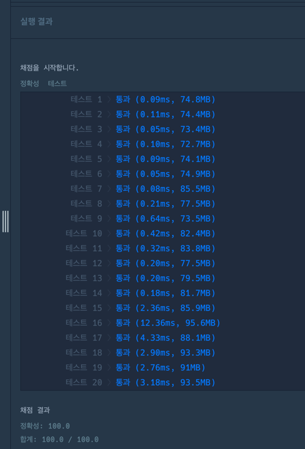

<div align="center">
<h1>🔥 택배 배달과 수거하기 🔥 </h1>
</div>

<br>

### 1. 문제 링크

[택배 배달과 수거하기](https://school.programmers.co.kr/learn/courses/30/lessons/150369)

### 2. 문제 풀이

#### 코드 1 - 시간 초과
```java
class Solution {
    public static void main(String[] args) {
        int cap = 2;
        int n = 7;
        int[] deliveries = {1, 0, 2, 0, 1, 0, 2};
        int[] pickups = {0, 2, 0, 1, 0, 2, 0};

        System.out.println(solution(cap, n, deliveries, pickups));
    }

    public static long solution(int cap, int n, int[] deliveries, int[] pickups) {
        long answer = 0;
        boolean flag = true;
        int idx = n - 1;
        int deliveryCount = 0;
        int pickupCount = 0;

        while (flag) {
            for (int i = idx; i >= 0; i--) {
                if (deliveries[i] > 0 || pickups[i] > 0) {
                    deliveryCount = 0;
                    pickupCount = 0;
                    idx = i;
                    answer += i + 1;
                    break;
                }
                if (i == 0) {
                    flag = false;
                }
            }

            for (int i = idx; i >= 0; i--) {
                if (deliveryCount < cap) {
                    deliveryCount = deliveryCount + deliveries[i];
                    deliveries[i] = deliveryCount > cap ? deliveryCount - cap : 0;
                }
                if (pickupCount < cap) {
                    pickupCount = pickupCount + pickups[i];
                    pickups[i] = pickupCount > cap ? pickupCount - cap : 0;

                }
                if (pickupCount >= cap && deliveryCount >= cap) {
                    break;
                }
            }
        }
        return answer * 2L;
    }
}
```

#### 코드 2 - 통과
```java
class Solution {
    public static void main(String[] args) {
        int cap = 2;
        int n = 7;
        int[] deliveries = {1, 0, 2, 0, 1, 0, 2};
        int[] pickups = {0, 2, 0, 1, 0, 2, 0};

        System.out.println(solution(cap, n, deliveries, pickups));
    }

    public static long solution(int cap, int n, int[] deliveries, int[] pickups) {
        long answer = 0;
        int deliveryCap = cap;
        int pickupCap = cap;

        for(int i = n - 1; i >= 0; i--){
            deliveryCap = deliveryCap - deliveries[i];
            pickupCap = pickupCap - pickups[i];

            while(deliveryCap < cap || pickupCap < cap){
                deliveryCap = deliveryCap + cap;
                pickupCap = pickupCap + cap;
                answer += (i + 1);
            }
        }

        return answer * 2L;
    }
}
```

**[ 시간 복잡도 - O(n) ]**
- 시간 초과가 발생한 코드의 시간 복잡도는 O(n^2)이다.
- n(배달할 집의 개수)에 100,000까지 올 수 있기 때문에 O(n^2)으로 구현하면 시간 초과가 발생한다.
- 해당 문제는 '최소' 이동 거리를 구해야 하기 때문에 물류 창고에서 가장 먼 집부터 순차적으로 배달 및 수거를 하면서 이동 거리를 줄여나가야 하는 것이 핵심이다.
- 시간 초과가 발생한 코드는 물류 창고에서 가장 먼 순서부터 택배/수거를 결정하는 index를 구하는 반복문(for 문)과 해당 index로 배달/수거의 횟수를 구하는 반복문(for 문)이 있고, 두 반복문을 감싸는 바깥쪽의 반복문(while)이 있다.
- index를 결정하는 반복문과 바깥의 while 문을 제거하고, 택배/수거의 횟수를 구하는 반복문에서 이동 횟수까지 바로 구할 수 있도록 변경하여 시간 복잡도를 O(n)으로 만들었다.

### 3. 코드 결과

